#MYSQL Prøve

## 1.1 Strukturer data i tabeller etter normaliseringsprinsippet (3. normalfrom). Lag et diagram som viser tabellstrukturen. Diagrammet må vise tydelig relasjoner, primærnøkler og fremmednøkler. 

### Skriv en kort begrunnelse om valg av struktur, alt skal legges ved i besvarelsen.

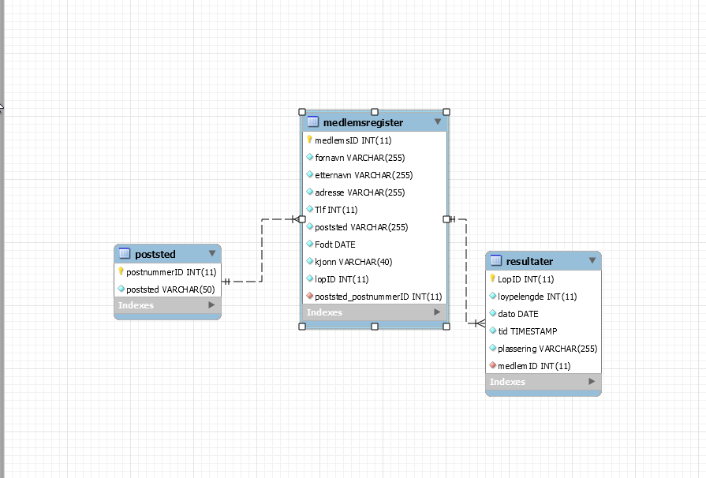

Jeg har valgt å sette opp tre tabeller der man bruker medlemsID som løpsID og postnummer som id i medlemsregisteret. Dette er for å skille data og det gjør det lettere. Det vil da si at det integreres med postnummeret og medlemsID slik at man ser hvilket medlem som har løpt hva. 

## 1.2Lag SQL-skript som viser:	

### A) Medlemsregister der du sorter på kjønn og alder.
Spørring

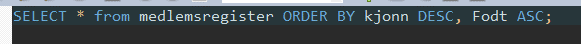

Resultat:
 
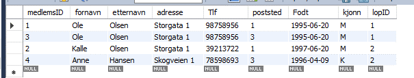

### B) Resultatliste for et enkelt løp.

Spørring

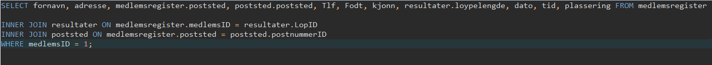

Resultat:
 
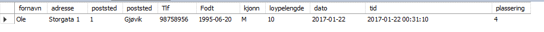 

## 1.3 Ta en komplett backup av databasen med data og lever denne på FRONTER
Backup blir lagt til i fronter også

 
## 2. Vis med bilder og tekst hvordan du kan ta backup og legge tilbake en backup av en database.
#### Importere en database:
Trykk først på «data import/restore»

 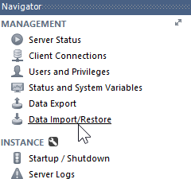
 

1.	Trykk på «import from «Self-contained-file»
2.	Velg hvilken database du skal importere.

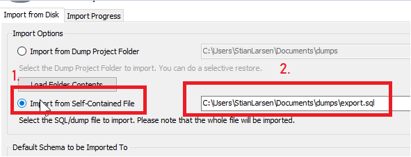

Klikk på «Start import» og databasen er importert.

 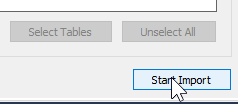

#### Exportering:
Trykk på «data export»

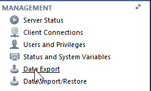

Velg hvilken database du vil exportere. 

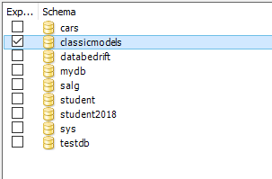
 
Du kan også velge hvilke tabeller du vil ha med i exporteringa

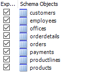
 

 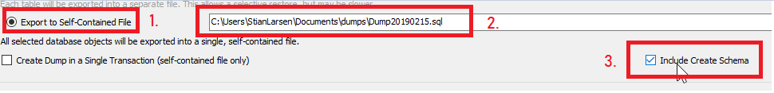

 
1.	Kryss av for «export to self-contained file» 
2.	Velg hvor du vil lagre filen og navngi den. 
3.	Kryss av på «Include Create Schema

### Du har brukt diagramverktøyet til designe en database i MySQL. Du gjør endringer på diagrammet etter du har generert databasen (schemas).  Hvordan får du enkelt "overført" denne endringen til databasen (schemas)?

Når du bruker modeller og endrer databasen i modellen bruker du «forward engineer» for å oppdatere databasen.

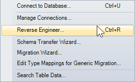
 
Eller hvis du er i databasen under «schemas» og har endret databasen igjennom kode, kan du trykke på «reverse engineer» for å automatisk lage modeller andre veien. 
 

## 4. Lag en spørring som finner alle kunder som begynner på bokstaven "C" og holder til i USA. 

Spørring:

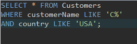

Resultat:
 
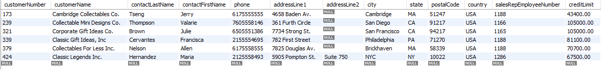

## 5. Lag en spørring der du regner ut total summen for de enkelte ordrene. 
 
Spørring:

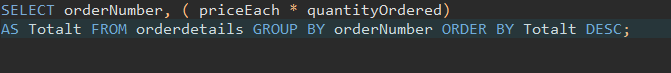

| Resultat fra prøve:| Mitt resultat:|
| :-: | :-: |
| 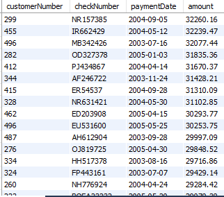 | 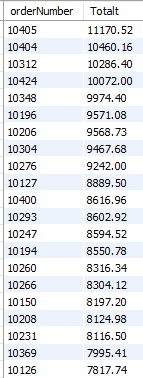 |
          		 

## 6. Lag en spørring som viser ordrene som er mindre enn gjennomsnittet. 

Spørring:
 
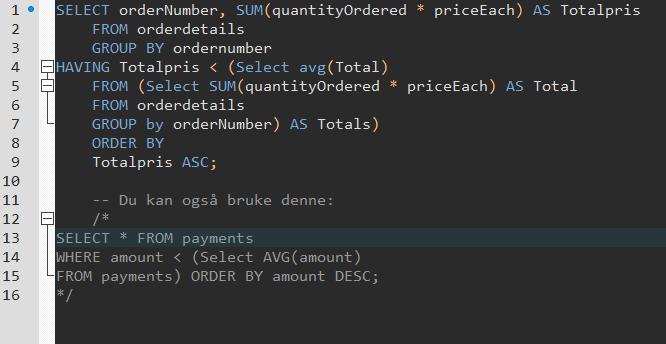

Resultat:
  

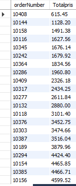

Den andre gir resultat: 
 

